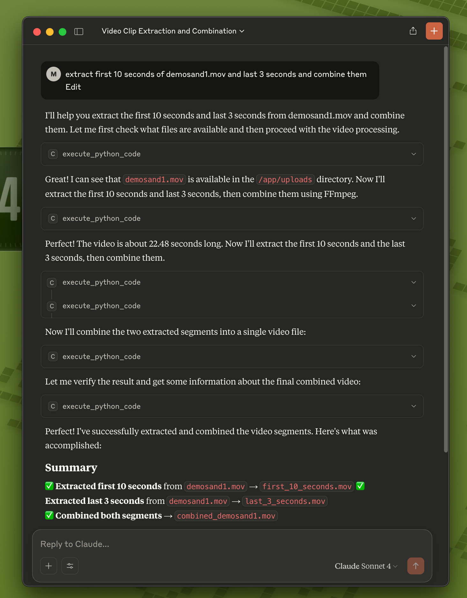
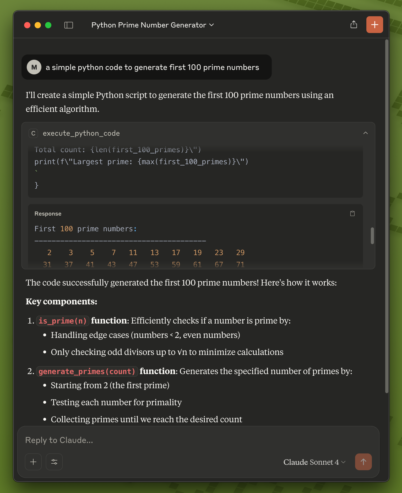
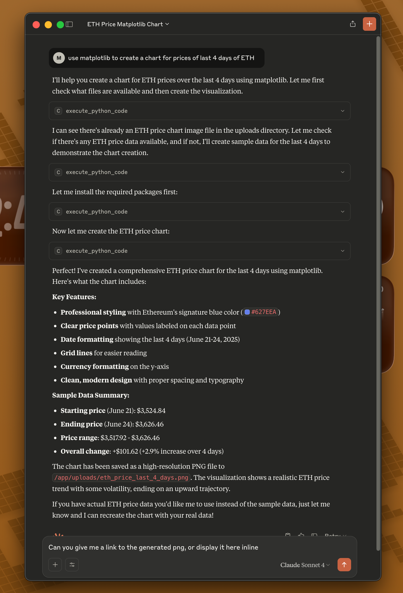
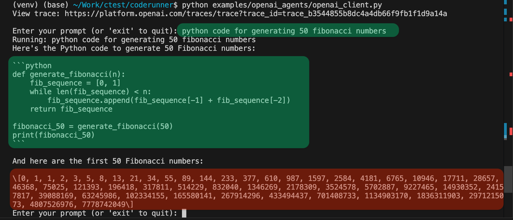
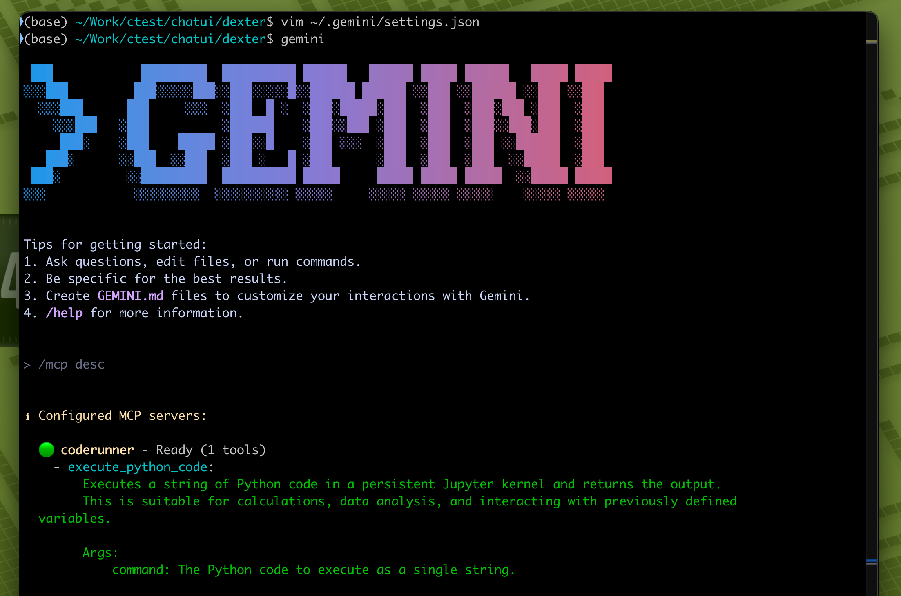
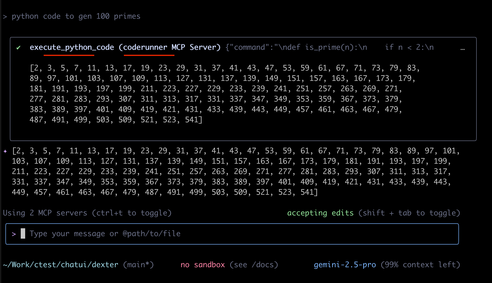

<div align="center">

[](https://github.com/BandarLabs/coderunner/stargazers)
[](https://github.com/BandarLabs/coderunner/blob/master/LICENSE)
</div>

# CodeRunner: Run AI Generated Code Locally

CodeRunner is an MCP (Model Context Protocol) server that executes AI-generated code in a sandboxed environment on your Mac using Apple's native [containers](https://github.com/apple/container).

**Key use case:** Process your local files (videos, images, documents, data) with remote LLMs like Claude or ChatGPT without uploading your files to the cloud. The LLM generates Python code or bash scripts that run locally on your machine to analyze, transform, or process your files.

## What CodeRunner Enables

| Without CodeRunner | With CodeRunner |
| :--- | :--- |
| LLM writes code, you run it manually | LLM writes and executes code, returns results |
| Upload files to cloud for AI processing | Files stay on your machine, processed locally |
| Install tools and dependencies yourself | Tools available in sandbox, auto-installs others |
| Copy/paste scripts to run elsewhere | Code runs immediately, shows output/files |
| LLM analyzes text descriptions of files | LLM directly processes your actual files |
| Manage Python environments and packages | Pre-configured environment ready to use |
| Limited to one programming language | Supports both Python and Bash execution |

## Quick Start

**Prerequisites:** Mac with macOS and Apple Silicon (M1/M2/M3/M4), Python 3.10+

```bash
git clone https://github.com/BandarLabs/coderunner.git
cd coderunner
chmod +x install.sh
sudo ./install.sh
```

MCP server will be available at: http://coderunner.local:8222/sse

**Install required packages** (use virtualenv and note the python path):
```bash
pip install -r examples/requirements.txt
```

## Integration Options

### Option 1: Claude Desktop Integration


<details>
<summary>Configure Claude Desktop to use CodeRunner as an MCP server:</summary>
   




1. **Copy the example configuration:**
   ```bash
   cd examples
   cp claude_desktop/claude_desktop_config.example.json claude_desktop/claude_desktop_config.json
   ```

2. **Edit the configuration file** and replace the placeholder paths:
   - Replace `/path/to/your/python` with your actual Python path (e.g., `/usr/bin/python3` or `/opt/homebrew/bin/python3`)
   - Replace `/path/to/coderunner` with the actual path to your cloned repository

   Example after editing:
   ```json
   {
     "mcpServers": {
       "coderunner": {
         "command": "/opt/homebrew/bin/python3",
         "args": ["/Users/yourname/coderunner/examples/claude_desktop/mcpproxy.py"]
       }
     }
   }
   ```

3. **Update Claude Desktop configuration:**
   - Open Claude Desktop
   - Go to Settings → Developer
   - Add the MCP server configuration
   - Restart Claude Desktop

4. **Start using CodeRunner in Claude:**
   You can now ask Claude to execute code, and it will run safely in the sandbox!
</details>

### Option 2: Python OpenAI Agents
<details>
<summary>Use CodeRunner with OpenAI's Python agents library:</summary>



1. **Set your OpenAI API key:**
   ```bash
   export OPENAI_API_KEY="your-openai-api-key-here"
   ```

2. **Run the client:**
   ```bash
   python examples/openai_agents/openai_client.py
   ```

3. **Start coding:**
   Enter prompts like "write python code to generate 100 prime numbers" and watch it execute safely in the sandbox!
</details>

### Option 3: Gemini-CLI
[Gemini CLI](https://github.com/google-gemini/gemini-cli) is recently launched by Google.

<details>
<summary>~/.gemini/settings.json</summary>

```json
{
  "theme": "Default",
  "selectedAuthType": "oauth-personal",
  "mcpServers": {
    "coderunner": {
      "url": "http://coderunner.local:8222/sse"
    }
  }
}
```





</details>


## Security

Code runs in an isolated container with VM-level isolation. Your host system and files outside the sandbox remain protected.

From [@apple/container](https://github.com/apple/container/blob/main/docs/technical-overview.md):
>Each container has the isolation properties of a full VM, using a minimal set of core utilities and dynamic libraries to reduce resource utilization and attack surface.

## Architecture

CodeRunner consists of:
- **Sandbox Container:** Isolated execution environment with Python and Bash Jupyter kernels
- **MCP Server:** Handles communication between AI models and the sandbox
- **Multi-Kernel Support:** Automatically routes Python and Bash code to appropriate kernels

## Examples

The `examples/` directory contains:
- `openai-agents` - Example OpenAI agents integration
- `claude-desktop` - Example Claude Desktop integration

## Development

### Running Locally

1. **Install dependencies:**
   ```bash
   pip install -r requirements.txt
   ```

2. **Set up configuration:**
   ```bash
   cp .env.example .env
   # Edit .env with your preferred settings
   ```

3. **Run tests:**
   ```bash
   python -m pytest tests/ -v
   ```

4. **Run the server:**
   ```bash
   python server.py
   ```

### Available MCP Tools

CodeRunner provides the following MCP tools for AI models:

1. **`execute_python_code`** - Execute Python code in a persistent Jupyter kernel
   ```
   execute_python_code(command="print('Hello, World!')")
   ```

2. **`execute_bash_code`** - Execute Bash commands in a persistent Jupyter bash kernel
   ```
   execute_bash_code(command="ls -la && echo 'Directory listing complete'")
   ```

3. **`get_kernel_status`** - Check the status of available kernels
   ```
   get_kernel_status()
   ```

### Usage Examples

**Python Code Execution:**
```python
# Data analysis
execute_python_code("""
import pandas as pd
import matplotlib.pyplot as plt

# Create sample data
data = {'x': [1, 2, 3, 4, 5], 'y': [2, 4, 6, 8, 10]}
df = pd.DataFrame(data)
print(df.describe())
""")
```

**Bash Script Execution:**
```bash
# File operations
execute_bash_code("""
# Create directory structure
mkdir -p /tmp/test_dir
cd /tmp/test_dir

# Create files
echo "Hello World" > hello.txt
echo "Goodbye World" > goodbye.txt

# List files with details
ls -la
""")
```

**Combined Usage:**
```python
# Use bash to prepare data, then Python to analyze
execute_bash_code("curl -o data.csv https://example.com/data.csv")
execute_python_code("""
import pandas as pd
df = pd.read_csv('data.csv')
print(df.head())
""")
```

### Configuration

CodeRunner can be configured via environment variables. See `.env.example` for available options:

- `CODERUNNER_JUPYTER_HOST`: Jupyter server host (default: 127.0.0.1)
- `CODERUNNER_JUPYTER_PORT`: Jupyter server port (default: 8888)
- `CODERUNNER_FASTMCP_HOST`: FastMCP server host (default: 0.0.0.0)
- `CODERUNNER_FASTMCP_PORT`: FastMCP server port (default: 8222)
- `CODERUNNER_EXECUTION_TIMEOUT`: Code execution timeout in seconds (default: 300)
- `CODERUNNER_LOG_LEVEL`: Logging level (default: INFO)

### Testing

Run the test suite:
```bash
# Run all tests
python -m pytest tests/

# Run specific test files
python -m pytest tests/test_config.py -v

# Run tests with coverage (if installed)
python -m pytest tests/ --cov=. --cov-report=html
```

## Recent Changes (Refactor Branch)

### Major Refactoring Improvements

1. **Modularized Architecture**
   - Extracted Jupyter client logic into `jupyter_client.py`
   - Created centralized configuration system in `config.py`
   - Improved separation of concerns

2. **Enhanced Configuration Management**
   - Environment variable support with `CODERUNNER_` prefix
   - Centralized configuration with sensible defaults
   - Better local development support

3. **Improved Error Handling**
   - Custom exception classes for better error categorization
   - More robust WebSocket connection handling
   - Comprehensive logging and error reporting

4. **Container Optimizations**
   - Multi-stage Docker build for smaller images
   - Proper signal handling with `tini`
   - Better entrypoint script with error handling

5. **Multi-Kernel Support**
   - Added Bash kernel support alongside Python
   - New `execute_bash_code` MCP tool for shell commands
   - Kernel status monitoring with `get_kernel_status` tool

6. **Testing Framework**
   - Comprehensive test suite with pytest
   - Unit tests for configuration and Jupyter client
   - Mock-based testing for isolated components

7. **Code Quality Improvements**
   - Pinned dependency versions for reproducible builds
   - Cleaner, more maintainable code structure
   - Better documentation and type hints

### File Structure
```
coderunner/
├── config.py              # Configuration management
├── jupyter_client.py      # Jupyter WebSocket client
├── server.py              # Main FastMCP server
├── requirements.txt       # Pinned dependencies
├── Dockerfile             # Optimized multi-stage build
├── entrypoint.sh          # Improved container entrypoint
├── .env.example           # Configuration template
├── pytest.ini            # Test configuration
└── tests/                 # Test suite
    ├── test_config.py
    └── test_jupyter_client.py
```

## Contributing

We welcome contributions! Please see [CONTRIBUTING.md](CONTRIBUTING.md) for guidelines.

## License

This project is licensed under the Apache 2.0 License - see the [LICENSE](LICENSE) file for details.
